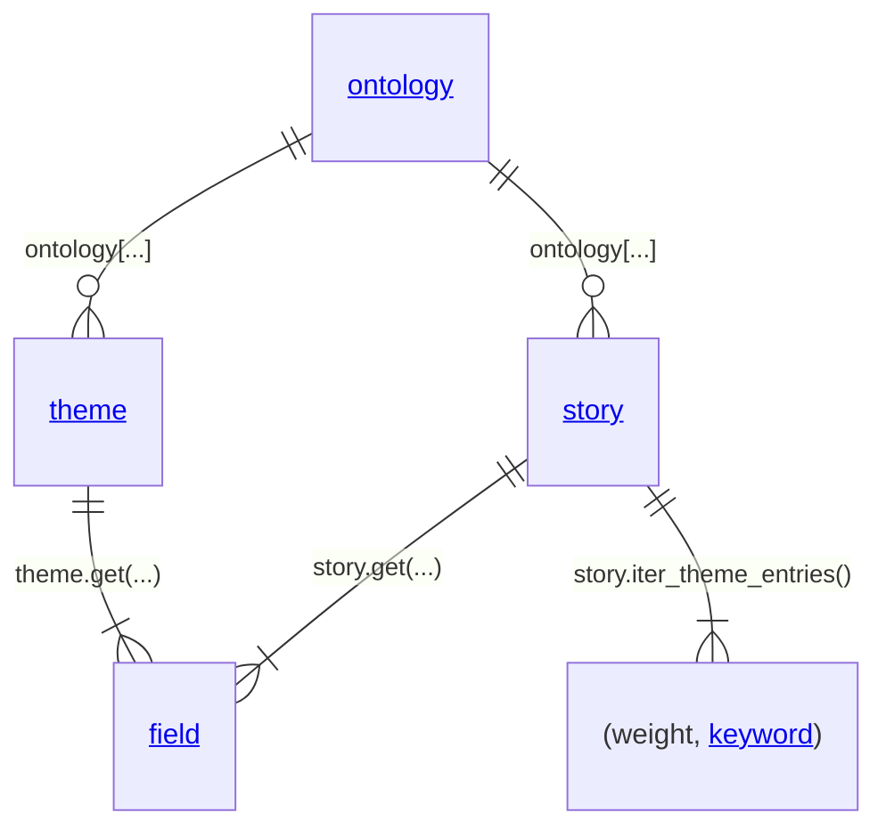

[](https://badge.fury.io/py/totolo)
[](https://codecov.io/gh/theme-ontology/python-totolo)
[](https://lifecycle.r-lib.org/articles/stages.html)
[](https://pypistats.org/packages/totolo)
[](https://opensource.org/licenses/MIT)

# totolo

A Python package for working with data from the Theme Ontology [theming repository](https://github.com/theme-ontology/theming/).

```
pip install totolo
```

Or clone this repository and copy the `totolo` directory wherever you need it. No package dependencies are required.



## totolo - Overview

Inline documentation:
[ontology](https://github.com/theme-ontology/python-totolo/blob/main/totolo/ontology.py),
[story](https://github.com/theme-ontology/python-totolo/blob/main/totolo/story.py),
[theme](https://github.com/theme-ontology/python-totolo/blob/main/totolo/theme.py),
[field](https://github.com/theme-ontology/python-totolo/blob/main/totolo/field.py),
[keyword](https://github.com/theme-ontology/python-totolo/blob/main/totolo/keyword.py).

Create an ontology object by, for example, fetching a named version remotely.
On the ontology object access stories or themes using their unique name and bracket notation.
Access basic information on the theme or story by accessing named fields using the get-method.
Named fields are defined with the *"sa"* annotation in the story and theme source code linked above at the top of the respective class.
Access minor/major/choice theme entries on a story by iterating over them.

```python
ontology = totolo.remote('v2025.04')
theme = ontology['theme_name']
story = ontology['story_name']
theme_description = theme.get("Description").str()
story_references = story.get("References").str()
for weight, keyword in story.iter_theme_entries():
    ...
```

Python's builtin methods `help()` and `dir()` yield useful information on any of these objects.
The above linked source code for them is intended to be readable.
For any story, theme, field or keyword objects you can obtain a text representation that is the same as it would be if the ontology was written to file.

```python
_ = story.text(); story.print()
_ = theme.text(); theme.print()
_ = field.str(); print(field)
_ = keyword.str(); print(keyword)
```

Although `totolo` can be used to programmatically edit the structure of the ontology, the documentation is
foremost intended for those who read the ontology to analyse it in python or feed it forwards.

## totolo - Basic Usage

```python
    #: import package
    >>> import totolo

    #: get the latest main branch version of the ontology
    >>> ontology = totolo.remote()
    >>> print(ontology)
<2945 themes, 4475 stories>

    #: write it or read it locally
    >>> ontology.write("/home/mo/themes")
    >>> ontology = totolo.files("/home/mo/themes")
    >>> print(ontology)
<2945 themes, 4475 stories>
```

###### Explore the stories

```python
    >>> story = ontology["movie: Ran (1985)"]
    >>> for weight, theme in story.iter_themes():
    ...     print(f"{weight:<15} {theme.name}")
```

```
Choice Themes   betrayal
Choice Themes   the lust for power
(...)
```

###### Explore the themes

```python
    #: go over all the themes and find the ones you want
    >>> for theme in ontology.themes():
    ...     if "romantic love" in theme.name:
    ...         print(theme)
b'personal freedom vs. romantic love'[3]
b'romantic love'[3]

    #: check the definition of a theme
    >>> love = ontology["love"]
    >>> love.print()
    (...)
```

###### Convert it to a pandas dataframe

```python
    >>> df = ontology.dataframe()
    >>> df
```

```
                                 story_id             title        date                      theme        weight
0                 theamericanshortstory01  The Music School        1974      human self-reflection  Major Themes
1                 theamericanshortstory01  The Music School        1974                     murder  Major Themes
...                                   ...               ...         ...                        ...           ...
52453  videogame: Final Fantasy VI (1994)  Final Fantasy VI  1994-04-02  feral children in society  Minor Themes
52454  videogame: Final Fantasy VI (1994)  Final Fantasy VI  1994-04-02             father and son  Minor Themes

[52455 rows x 5 columns]
```

## totolo - Snippets

###### List official versioned releases of the ontology, then load one

```python
    print(list(totolo.remote.versions()))
    ontology = totolo.remote.version('v2023.06')
```

###### Create an excel sheet with all the usages of the theme "loyalty" as well as any child theme of the same

```python
    df = ontology['loyalty'].descendants().dataframe(motivation=True, descriptions=True)
    df.to_excel("/mnt/d/repos/themelist-loyalty.xlsx", "loyalty")
```

###### Find theme entries in stories according to some criteria, for example, find empty motivations

```python
    empty_motivations = [
        (story, weight, part)
        for story in ontology.stories()
        for weight, part in story.iter_theme_entries()
        if part.motivation.strip() == ""
    ]
```

## totolo - Getting Help

If you encounter a bug, please file a minimal reproducible example on
[GitHub issues](https://github.com/theme-ontology/python-totolo/issues/). For
feature requests and other matters, please post on the [GitHub discussions
board](https://github.com/theme-ontology/python-totolo/discussions/).


###### Files and Code Test Coverage

[](https://codecov.io/gh/theme-ontology/python-totolo)
